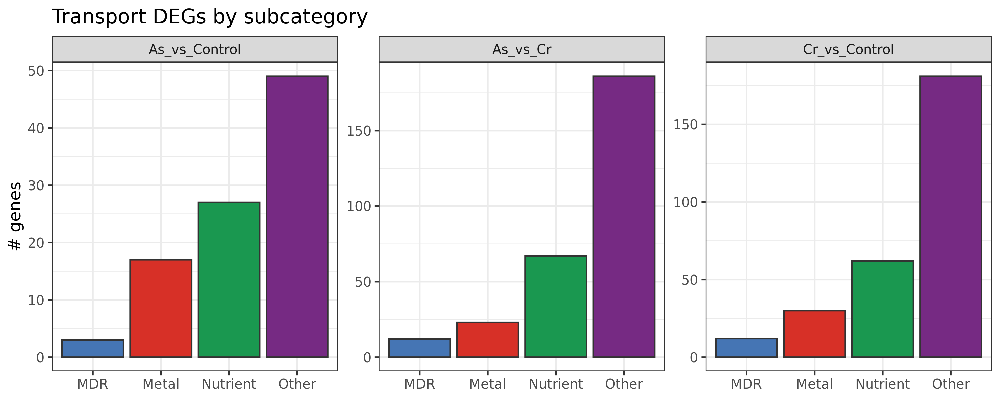

```{r setup, include=FALSE}
knitr::opts_chunk$set(echo = FALSE, message = FALSE, warning = FALSE)
userlib <- path.expand("~/R/library")
if (dir.exists(userlib)) .libPaths(c(userlib, .libPaths()))
library(data.table)
library(knitr)
library(DT)
proj_dir <- "/mnt/c/Users/kuris/OneDrive/Escritorio/tesis/trancriptoma"
out_dir  <- file.path(proj_dir, "reports", "transport_full")
comparisons <- c("As_vs_Control", "Cr_vs_Control", "As_vs_Cr")
subcats <- c("Metal", "MDR", "Nutrient", "Other")
thr_padj <- 0.05
thr_lfc  <- 1
img <- function(name) file.path(out_dir, name)
tsv <- function(name) file.path(out_dir, name)
counts_file <- tsv("transport_counts_by_subcat.tsv")
stopifnot(file.exists(counts_file))
counts <- fread(counts_file)
counts_wide <- dcast(counts, comparison ~ subcat, value.var="n", fill=0)
fmt_p <- function(x) { if (is.na(x)) return(NA_character_); if (x < 0.001) return(format(x, scientific=TRUE, digits=2)); format(round(x,4), nsmall=4) }
pick_col <- function(dt, candidates) { hit <- candidates[candidates %in% names(dt)][1]; if (is.na(hit)) return(NULL); hit }
make_gene_label <- function(dt) {
  idcol <- pick_col(dt, c("id","pretty_id","gene_id"))
  desccol <- pick_col(dt, c("description","product","annotation","gene_name","Gene","name"))
  if (is.null(idcol)) idcol <- names(dt)[1]
  if (!is.null(desccol)) paste0(dt[[idcol]], " — ", dt[[desccol]]) else as.character(dt[[idcol]])
}
```

## Executive summary

```{r}
exec <- copy(counts)
exec[, n := as.integer(n)]
exec_tot <- exec[, .(total_transport = sum(n, na.rm=TRUE)), by=comparison]
exec2 <- merge(exec, exec_tot, by="comparison", all.x=TRUE)
exec2[, pct := ifelse(total_transport > 0, round(100*n/total_transport, 1), 0)]
setorder(exec2, comparison, -n)
topcat <- exec2[, .SD[1], by=comparison]
summary_tbl <- merge(exec_tot, topcat[, .(comparison, top_subcat=subcat, top_n=n, top_pct=pct)], by="comparison")
DT::datatable(summary_tbl, rownames=FALSE, options=list(pageLength=10))
```

## 1) Counts by subcategory

```{r}
DT::datatable(counts_wide, rownames=FALSE, options=list(pageLength=10))
```

```{r}
if (file.exists(img("transport_counts_by_subcat.png"))) 
```

## 2) Plots per comparison

```{r, results="asis"}
for (comp in comparisons) {
  cat("\n\n### ", comp, "\n\n", sep="")
  sub <- counts[comparison == comp]
  if (nrow(sub) > 0) {
    tot <- sum(sub$n, na.rm=TRUE)
    cat("**Summary:** ", tot, " Transport DEGs. Volcano thresholds: `padj < ", thr_padj, "` and `|log2FC| ≥ ", thr_lfc, "`.\n\n", sep="")
  }
  plots <- c(sprintf("%s_volcano_transport.png", comp), sprintf("%s_MA_transport.png", comp), sprintf("%s_log2fc_hist.png", comp), sprintf("%s_log2fc_box.png", comp))
  for (p in plots) if (file.exists(img(p))) cat("\n\n", sep="")
}
```

## 3) Auto-generated Results text (descriptive)

```{r, results="asis"}
topN <- 4
for (comp in comparisons) {
  cat("\n\n### ", comp, " — Results text\n\n", sep="")
  for (s in subcats) {
    up_f <- sprintf("%s_%s_top_up.tsv", comp, s)
    dn_f <- sprintf("%s_%s_top_down.tsv", comp, s)
    if (!file.exists(tsv(up_f)) && !file.exists(tsv(dn_f))) next
    cat("#### ", s, "\n\n", sep="")
    if (file.exists(tsv(up_f))) cat("- Top up TSV: [", up_f, "](", up_f, ")\n", sep="")
    if (file.exists(tsv(dn_f))) cat("- Top down TSV: [", dn_f, "](", dn_f, ")\n\n", sep="")
    if (file.exists(tsv(up_f))) {
      up <- fread(tsv(up_f)); up <- up[order(-as.numeric(log2FoldChange))]; up <- head(up, topN)
      labs <- make_gene_label(up); lfc <- as.numeric(up$log2FoldChange); pad <- as.numeric(up$padj)
      items <- paste0(labs, " (log2FC=", round(lfc,2), "; padj=", vapply(pad, fmt_p, character(1)), ")")
      cat("**Most up-regulated (top ", topN, "):** ", paste(items, collapse="; "), ".\n\n", sep="")
    }
    if (file.exists(tsv(dn_f))) {
      dn <- fread(tsv(dn_f)); dn <- dn[order(as.numeric(log2FoldChange))]; dn <- head(dn, topN)
      labs <- make_gene_label(dn); lfc <- as.numeric(dn$log2FoldChange); pad <- as.numeric(dn$padj)
      items <- paste0(labs, " (log2FC=", round(lfc,2), "; padj=", vapply(pad, fmt_p, character(1)), ")")
      cat("**Most down-regulated (top ", topN, "):** ", paste(items, collapse="; "), ".\n\n", sep="")
    }
  }
}
```

## 4) Top tables (interactive)
Use the table search box (e.g., TRI12, ABCG, P-type, ZIP, Ctr) to filter.

```{r, results="asis"}
for (comp in comparisons) {
  cat("\n\n### ", comp, "\n\n", sep="")
  for (s in subcats) {
    up_f <- sprintf("%s_%s_top_up.tsv", comp, s)
    dn_f <- sprintf("%s_%s_top_down.tsv", comp, s)
    if (!file.exists(tsv(up_f)) && !file.exists(tsv(dn_f))) next
    cat("\n\n#### ", s, "\n\n", sep="")
    if (file.exists(tsv(up_f))) cat("- Top up TSV: [", up_f, "](", up_f, ")\n", sep="")
    if (file.exists(tsv(dn_f))) cat("- Top down TSV: [", dn_f, "](", dn_f, ")\n\n", sep="")
    if (file.exists(tsv(up_f))) { up <- fread(tsv(up_f)); print(DT::datatable(up, rownames=FALSE, options=list(pageLength=10, scrollX=TRUE))); cat("\n\n") }
    if (file.exists(tsv(dn_f))) { dn <- fread(tsv(dn_f)); print(DT::datatable(dn, rownames=FALSE, options=list(pageLength=10, scrollX=TRUE))); cat("\n\n") }
  }
}
```
